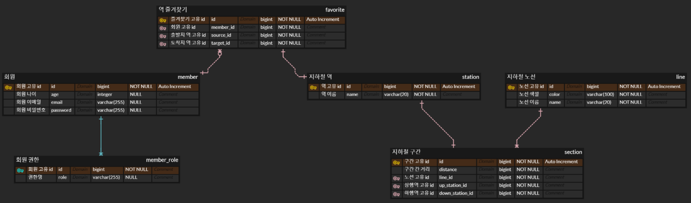

# NEXTSTEP 지하철 노선도 미션
> [ATDD 강의](https://edu.nextstep.camp/c/R89PYi5H) 실습을 위한 지하철 노선도 애플리케이션

## 미션 피드백 링크

- Step 1 : [https://github.com/next-step/atdd-subway-favorite/pull/413](https://github.com/next-step/atdd-subway-favorite/pull/413)
- Step 2 : [https://github.com/next-step/atdd-subway-favorite/pull/440](https://github.com/next-step/atdd-subway-favorite/pull/440)
- Step 3 : [https://github.com/next-step/atdd-subway-favorite/pull/451](https://github.com/next-step/atdd-subway-favorite/pull/451)

## 미션 관련 ERD
- ERD Cloud - https://www.erdcloud.com/d/tquYyrSeEHaqpZThG

## 미션 내용

### STEP 1
- [x] 로그인
    - [x] 토큰 생성 API
        - 아이디와 패스워드를 이용하여 토큰 생성
    - [x] 내 정보 조회 API
        - 로그인 시 생성된 토큰을 이용하여 내 정보 조회

### STEP 2
- [x] GitHub 로그인 검증 인수 테스트
- [x] Github를 이용한 로그인 구현 (토큰 발행)
- [x] 가입이 되어있지 않은 경우 회원 가입으로 진행 후 토큰 발행

### STEP 3
- [x] 경로 즐겨 찾기
  - [x] 즐겨 찾기 생성
  - [x] 즐겨 찾기 조회
  - [x] 즐겨 찾기 삭제
  - [x] 내 정보 관리 / 즐겨 찾기 기능은 로그인 된 상태에서만 가능
- [x] 예외
  - [x] 비로그인이거나 유효하지 않을 경우 401 Unauthorized 응답
