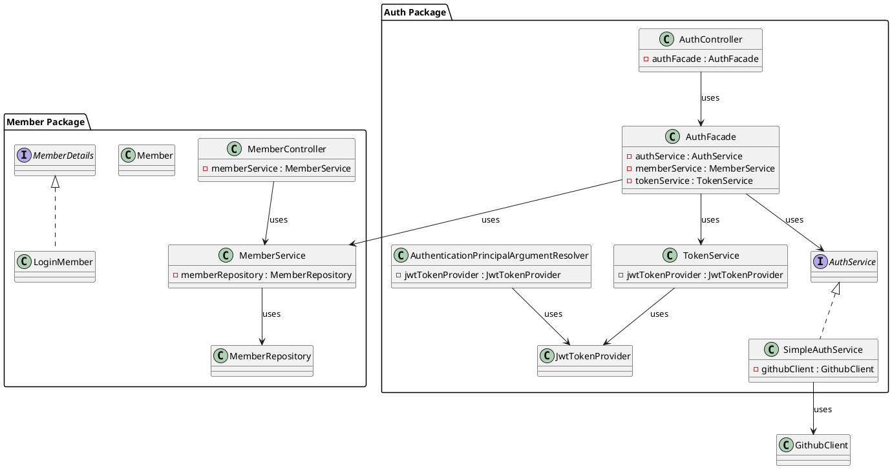
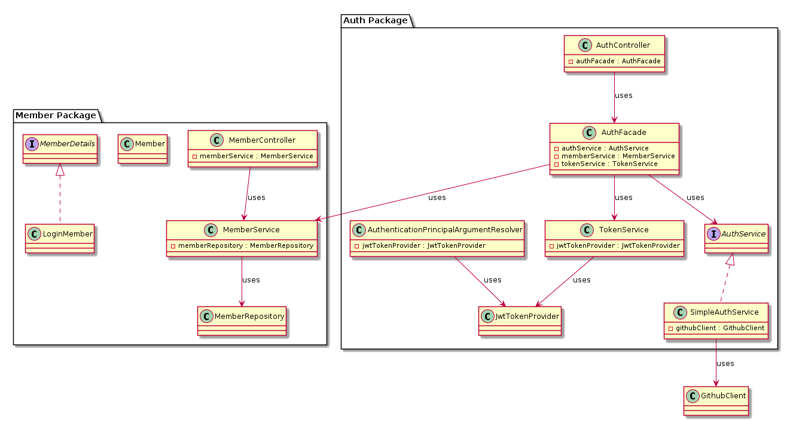

```plantuml
@startuml

package "Auth Package" {
    class AuthController {
        - authFacade : AuthFacade
    }

    class AuthenticationPrincipalArgumentResolver {
        - jwtTokenProvider : JwtTokenProvider
    }

    class SimpleAuthService implements AuthService {
        - githubClient : GithubClient
    }

    class TokenService {
        - jwtTokenProvider : JwtTokenProvider
    }

    class AuthFacade {
        - authService : AuthService
        - memberService : MemberService
        - tokenService : TokenService
    }

    class JwtTokenProvider {
    }
}

package "Member Package" {
    class MemberController {
        - memberService : MemberService
    }

    class MemberService {
        - memberRepository : MemberRepository
    }

    class MemberRepository {
    }

    class Member {
    }

    class LoginMember implements MemberDetails {
    }
}

AuthController --> AuthFacade : uses
AuthenticationPrincipalArgumentResolver --> JwtTokenProvider : uses
SimpleAuthService --> GithubClient : uses
TokenService --> JwtTokenProvider : uses
AuthFacade --> AuthService : uses
AuthFacade --> MemberService : uses
AuthFacade --> TokenService : uses
MemberController --> MemberService : uses
MemberService --> MemberRepository : uses

@enduml
```

