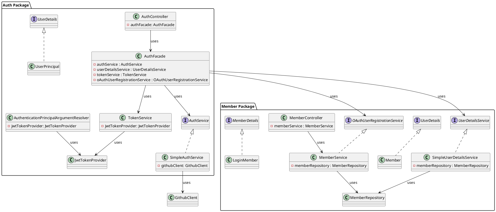
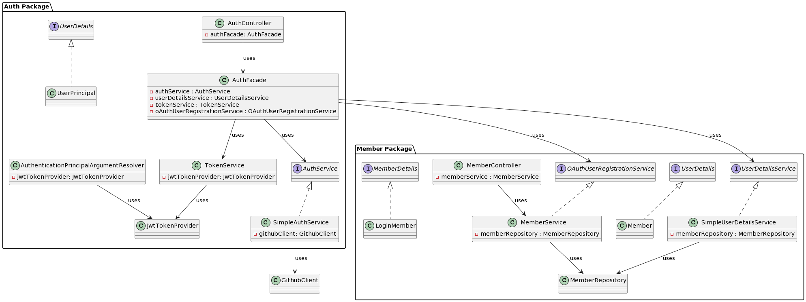

```plantuml
@startuml
package "Auth Package" {
class AuthController {
- authFacade: AuthFacade
}

    class AuthenticationPrincipalArgumentResolver {
        -jwtTokenProvider: JwtTokenProvider
    }

    class SimpleAuthService implements AuthService {
        - githubClient: GithubClient
    }

    class TokenService {
        -jwtTokenProvider: JwtTokenProvider
    }

    class AuthFacade {
        - authService : AuthService
        - userDetailsService : UserDetailsService
        - tokenService : TokenService
        - oAuthUserRegistrationService : OAuthUserRegistrationService
    }

    class JwtTokenProvider {
    }

    class UserPrincipal implements UserDetails {
    }

}

package "Member Package" {
class MemberController {
- memberService : MemberService
}

    class MemberService implements OAuthUserRegistrationService {
        - memberRepository : MemberRepository
    }

    class MemberRepository {
    }

    class Member implements UserDetails {
    }

    class LoginMember implements MemberDetails {
    }

    class SimpleUserDetailsService implements UserDetailsService {
        - memberRepository : MemberRepository
    }
}

AuthController --> AuthFacade: uses
AuthenticationPrincipalArgumentResolver --> JwtTokenProvider : uses
SimpleAuthService --> GithubClient : uses
TokenService --> JwtTokenProvider: uses
AuthFacade --> AuthService : uses
AuthFacade --> UserDetailsService : uses
AuthFacade --> TokenService : uses
AuthFacade --> OAuthUserRegistrationService : uses
MemberController --> MemberService : uses
MemberService --> MemberRepository : uses
SimpleUserDetailsService --> MemberRepository : uses
@enduml
```

